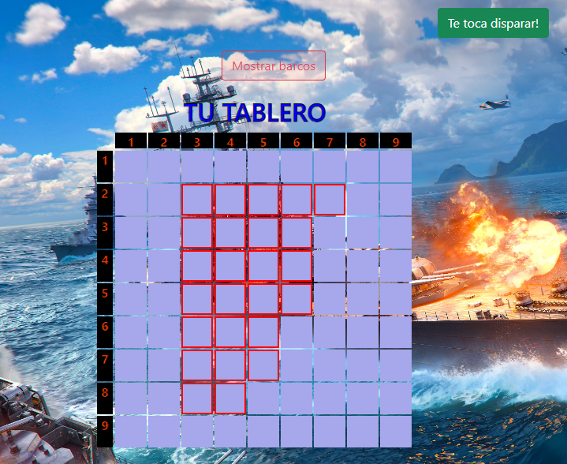
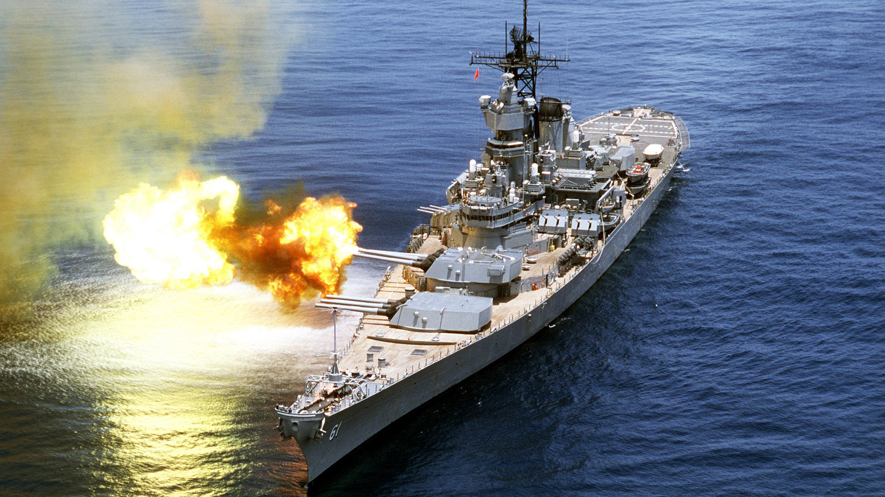

# Battleship: Tactics and strategy!

- Esta app fue creada usando las siguientes tecnologías: HTML5, CSS3, Bootstrap, JavaScript y React.

- El template usado es similar a create-react-app (CRA), pero corresponde al boilerplate de 4Geeks Academy: react-hello.

##  Como inicializar la app

1. Clonar el repositorio:

    $ git clone git@github.com:Zagarsix/Battleship-online.git

2. Crear un archivo .env:

    $ cp .env.example .env

3. Instalar el paquete npm:

    $ npm install

4. Inicializar el servidor local:

    $ npm run start

La App estará disponible en [localhost](http://localhost:3000/)

### Instrucciones del juego

- Debes elegir la posición de tus barcos, de forma horizontal o vertical. 

- El subtítulo indica el tipo de barco que debes ubicar y los espacios que ocupa en el tablero. (cuadrados grises)

- Una vez que hayas posicionado tus barcos, la CPU distribuirá sus barcos automáticamente. 

- Tú eres el primero en "disparar", según indica el botón central: en verde, si es tu turno. O en rojo, cuando dispara la CPU.

- Si aciertas, el cuadrado quedará marcado en color gris con naranjo (barco con fuego). De lo contrario, quedará marcado en azul con blanco, simulando el agua.

- Siempre que lo desees, puedes verificar la posición de tus barcos, presionando el botón "mostrar barcos" que se encuentra en la parte superior de tu tablero.

- Finalmente, quien logre hundir todos los barcos del contrincante, se coronará como ganador de Battleship!!! Suerte!!!
